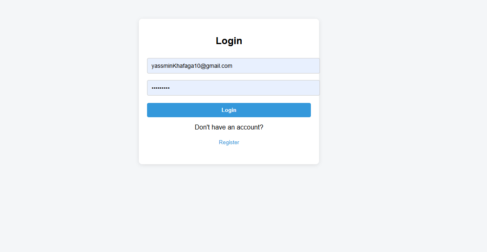
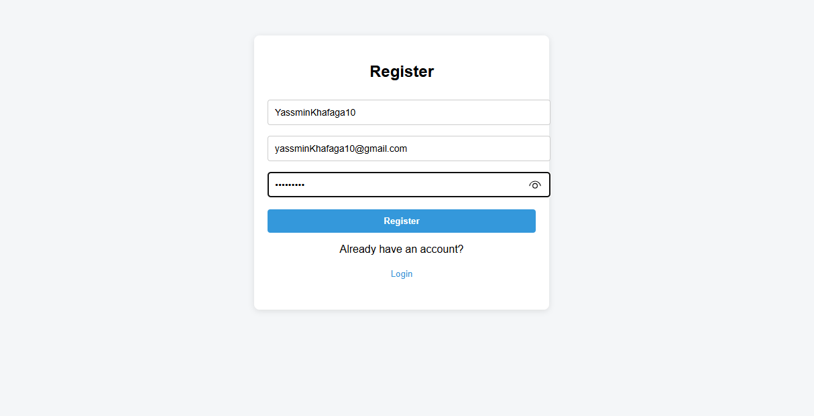
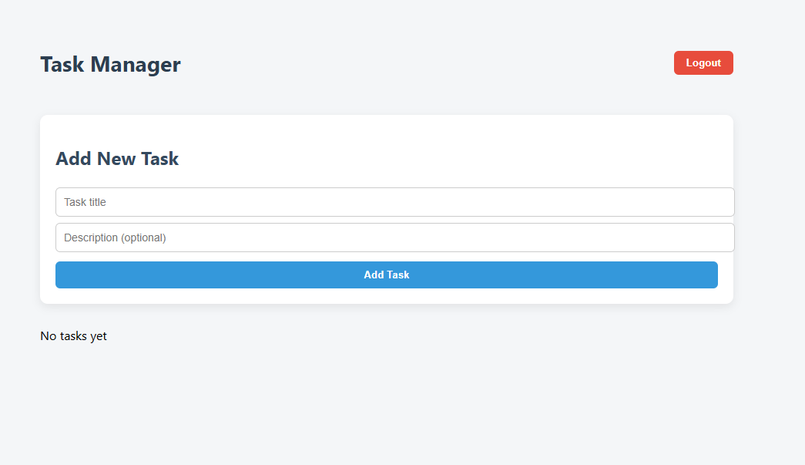

# Task Management App
A simple Task Management Application built with Node.js + React for managing tasks (CRUD) with user authentication.
## Tech Stack
- Backend: Node.js, Express, Sequelize
- Frontend: React, Axios, React Router
- Database: SQLite
- Authentication: JWT
## Setup Instructions

1. Clone the repository:
git clone <your-repo-link>

2. Backend:
cd backend
npm install
npm run dev   # server on port 5000

3. Frontend:
cd frontend
npm install
npm start     # React app on port 3000

## API Endpoints

### Authentication
POST /auth/register {name, email, password} - register
POST /auth/login {email, password} - login

### Tasks
GET /tasks - get tasks
POST /tasks {title, description} - add task
PUT /tasks/:id/status {status} - update status
DELETE /tasks/:id - delete task
## Features
- User registration and login with JWT
- CRUD operations for tasks
- Clean UI
- Pagination
## Notes
- Each user can only access their own tasks
- Passwords hashed in database
- Frontend opens on Login page
## bouns
Protected Routes (Bonus)
- Bonus: Protected routes implemented using PrivateRoute.js. Although the app already opens on the Login page by default, this shows readiness for future protected route expansion.

Pagination
- Pagination implemented for tasks list

## Screenshots
Login Page: 
Register Page: 
Tasks Page: 
Tasks Page: 